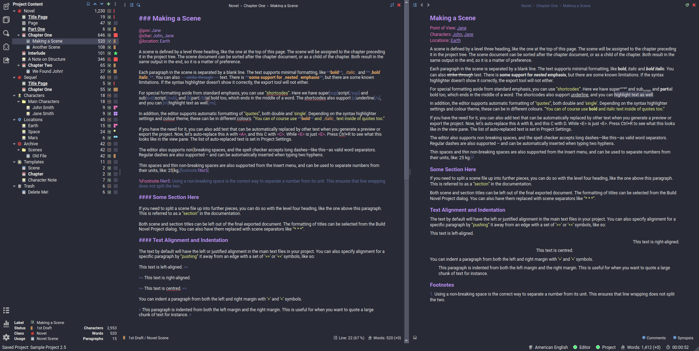
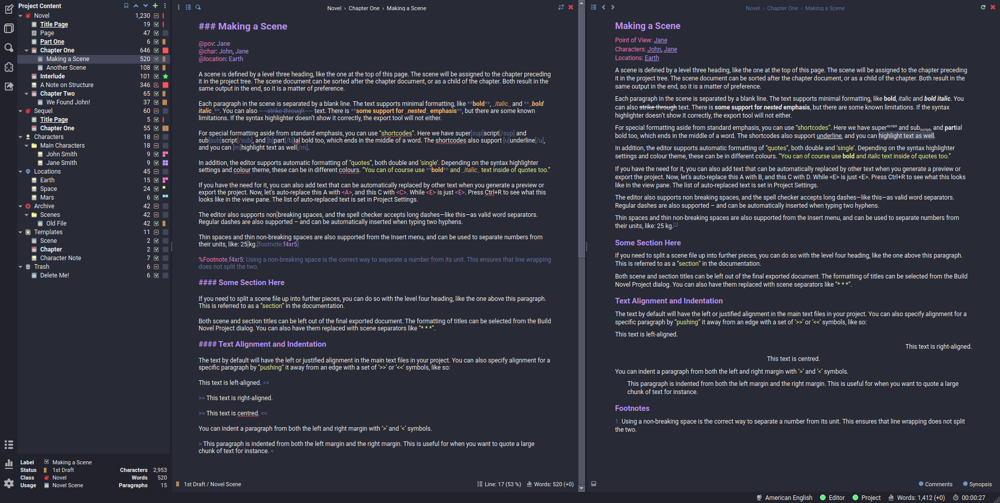

# Dracula for [novelWriter](https://novelwriter.io/)

> A dark theme for [novelWriter](https://novelwriter.io/).

## Install

All instructions can be found at [draculatheme.com/novel-writer](https://draculatheme.com/novel-writer).

## novelWriter 2.5 Update

[As of novelWriter 2.5](https://novelwriter.io/releases/release_2_5.html#theme-additions), a Dracula GUI and syntax theme comes bundled with the software. The native version differs slightly from our original themes, which remain available for use as alternatives.

## Team

This theme is maintained by the following person(s) and a bunch of [awesome contributors](https://github.com/dracula/novel-writer/graphs/contributors).

|  |
| ---------------------------------------------------------------------------------------------- |
| [Brandon Vout](https://github.com/brandonvout)                                                 |

## Community

-   [Twitter](https://twitter.com/draculatheme) - Best for getting updates about themes and new stuff.
-   [GitHub](https://github.com/dracula/dracula-theme/discussions) - Best for asking questions and discussing issues.
-   [Discord](https://draculatheme.com/discord-invite) - Best for hanging out with the community.

## License

[MIT License](./LICENSE)
